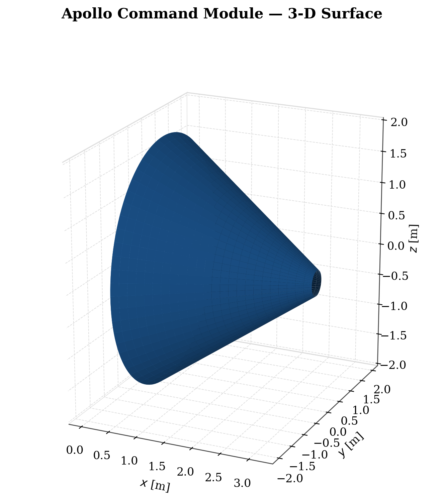
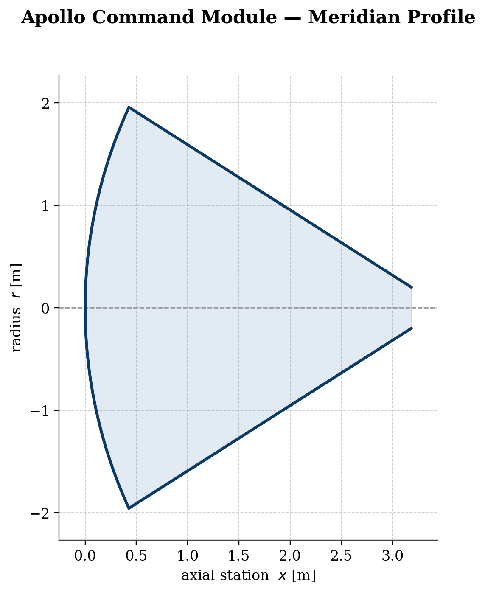
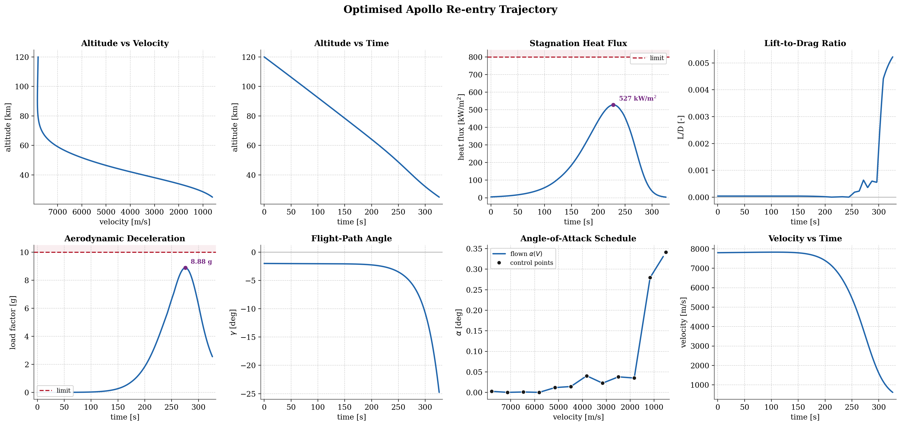
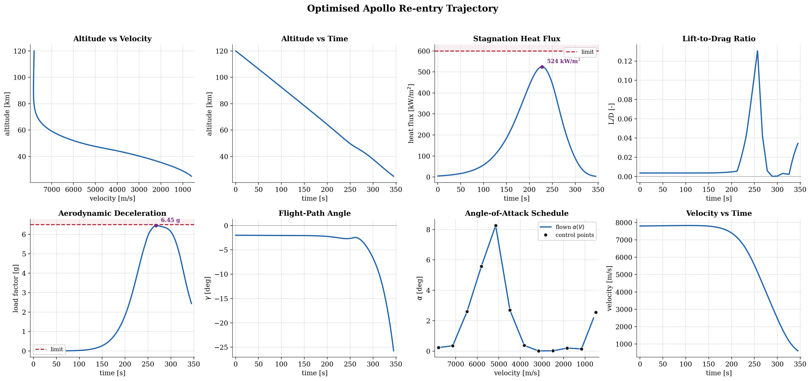
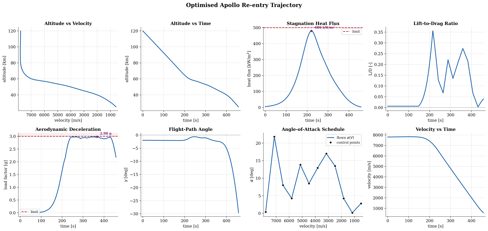

# re-entry-trajectory-optimization


> **Executive Summary:** A 3-Degree-of-Freedom (3-DOF) flight dynamics simulation and trajectory optimization tool for an Apollo-style re-entry capsule. Built using the **European Space Agency's PyGMO framework**, this project utilizes Self-Adaptive Differential Evolution (SADE) to find the optimal Angle of Attack ($\alpha$) schedule that minimizes integrated stagnation heat load while strictly adhering to peak heating and aerodynamic G-load constraints.

---

## Introduction

This project aims to provide a rudimentary baseline for further work on trajectory optimization using ESA's PyGMO. Loosely based on concepts and ideas from Anderson's "Hypersonic and High Temperature Gas Dynamics", it provides a first estimate for trajectory optimization using interpolated angle of attack scheduling during re-entry. The goal of the optimization is to minimize the total stagnation heat absorbed during re-entry, with constraints placed on the peak stagnation point heat transfer and deceleration G-load. A model geometry of the Apollo crew capsule was used due to its simplicity in implementation. While active angle of attack scheduling and control is not dynamically an option for such a vehicle with traditional control systems (such as bank angle reversal), the largely modular physics engine provides a baseline for use with more advanced geometries (e.g. space shuttles and spaceplanes with direct aerodynamic control over angle of attack).

## Physics & Modeling Methodology

A mesh was created using existing dimensions of the Apollo crew capsule. The geometry used is shown in the figures below. The coordinate system used defines lift as positive upwards perpendicular to the velocity vector. As the aft part of the vehicle is facing forward, a positive angle of attack is defined as the direction in which positive lift is defined (heat shield facing towards the ground). Constants and parameters relating to the capsule are readily available and were obtained from existing literature where possible.

<p align="center">
  
  
</p>

This simulation makes a substantial number of physical and mathematical assumptions, which are expanded on below.

* **Point Mass/Forces, 3-DOF:** Rotational dynamics, moments of inertia, and true state control are not considered. As a result, the assumption is made that the control system has full and immediate authority on the state of the system. Furthermore, considerations to static and dynamic stability are neglected.
* **Constant Mass:** No mass loss/change during re-entry (usually as a result of ablation of TPS or RCS propellant).
* **Spherical, Non-Rotating Earth:** Earth's oblateness (J2 correction factor etc.) as well as Earth's rotation and the coriolis effect are neglected.
* **(Modified) Newtonian Impact Theory for Lift and Drag:** The hypersonic thin-shock-layer approximation method is assumed for the full flight path. This assumption was made as a result of the lack of reliable aerodynamic data for the Apollo capsule outside of the hypersonic and high-supersonic regimes. For most trajectories, this is not too much of an issue as the velocity reached at the terminal phase hand-off is still $M\approx 3$ (thus only impacting the end of the trajectory after the point of peak heating).
* **Calorically Perfect, Constant $\gamma$ Air:** Ionization and high-temperature effects are largely neglected, $\gamma=1.4=const$.
* **No Viscous Drag:** Once again, neglected as a result of lack of reliable data. Easy to implement.
* **Sutton-Graves Stagnation-Point Correlation for Heat Transfer:** Semi-empirical, convective, laminar, cold-wall formula. Naturally, this is not the case in true re-entry, but it provides a strong starting point for further development. 
* **No Radiative Heating:** Only necessary for lunar-return+ re-entry trajectories (model is currently used for LEO trajectories).
* **International Standard Atmosphere:** The ISA model is used to represent the atmosphere starting from the entry interface.

The trajectory optimization forms a non-linear optimal control problem. As a result, Self-Adaptive Differential Evolution (SADE) was selected as the optimization algorithm. To ensure solution robustness, the problem is transformed into a Non-Linear Programming (NLP) problem using angle of attack scheduling over velocity instead of time. Outside of these control points, the angle of attack state is linearly interpolated. The objective function aims to minimize the total integrated heat absorbed by the vehicle, defined as the time integral of the stagnation point heat flux.

$J = \int_{t_0}^{t_f} \dot{q}(t) dt$

Strong constraints are further placed on the maximum stagnation heat flux and maximum deceleration in Gs. These constraints are enforced via substantial numerical penalties added to the fitness function to force the optimizater to adhere to the constraints. The trajectory is integrated using a 4th-order Runge Kutta (RK4) integrator.

## Example Results and Brief Discussion

The section below shows some example results for three different cases which may be modelled using this optimization routine. The first figure represents an essentially unconstrained re-entry profile. The second figure has moderate constraints on both variables. Finally, the third figure shows a trajectory with strong constraints on both G-loads and peak stagnation point heat transfer.

* Results for $G_{max}=10.0$, $\dot{q}_{peak}=800$ $kW/m^2$
<p align="center">
  
</p>

* Results for $G_{max}=6.5$, $\dot{q}_{peak}=600$ $kW/m^2$
<p align="center">
  
</p>

* Results for $G_{max}=3.0$, $\dot{q}_{peak}=500$ $kW/m^2$
<p align="center">
  
</p>

All three profiles demonstrate realistic re-entry profiles given the developed physics model. As expected, the lower the aerodynamic deceleration constraint, the more lift is required to keep the capsule decelerating slowly at the higher parts of the atmosphere as long as possible. The unconstrained ballistic trajectory in the first figure also shows an alpha scheduling of practically zero angle of attack, as the easiest way to reduce total heat absorbed is to reduce heating time (decelerate as fast as possible). Notably, the first two figures also indicate that the optimized trajectory does not hit the peak stagnation heat flux ceiling prescribed by the constraint. This is a result of the natural correlation between the trajectory shape and the peak heating as a result of the G-load constraint. A full analysis of the system is outside the scope of the current project, but will be reviewed in future versions of this project.

## Limitations

As a result of the substantial physical assumptions made in the derivation of this model, significant improvements must be made to future versions to increase accuracy. These primarily include incorporating more accurate aerodynamic data for the full flight profile, as well as incorporating real gas and high temperature aerothermal effects. Furthermore, improvements may be made by expanding the physical model beyond a point-force model, allowing stability analyses and more accurate control system development.

Another limitation which must be discussed is the use of a metaheuristic optimization model. As a result of such an optimization method, it cannot be mathematically concluded that the optimized trajectory is a true minimum for the desired objective function. However, for the scope of this project, this is accepted.

---

## Repository Structure

To ensure system stability, the numerical optimization and the data visualization pipelines are strictly decoupled into separate scripts. This prevents known C++ segmentation faults caused by threading clashes between PyGMO and Matplotlib.

* `main.py` — The core 3-DOF physics engine and PyGMO optimization routine. Generates the 3D surface mesh, runs the evolutionary algorithm, and exports results.
* `atmosphere.py` — The standalone 1976 US Standard Atmosphere calculator.
* `plot_results.py` — Visualizes the trajectory parameters in time and altitude.
* `plot_geom.py` — Visualizes the generated 3D surface mesh and 2D meridian profile of the Apollo capsule (or any input mesh).

---

## Installation & Usage

### Dependencies
Because PyGMO is a wrapper around heavily optimized C++ libraries, it is highly recommended to install it via `conda` rather than standard pip to avoid build-chain errors.

```bash
conda install -c conda-forge pygmo
pip install numpy scipy matplotlib
```

Some issues were faced during runtime with C++ segmentation faults as a result of clashes between the PyGMO and matplotlib threads. This was fixed by splitting the primary optimizer (which requires PyGMO) and the plotting routines. If the plotting routines do not load correctly, it is recommended to run the plotting scripts on a separate Python environment (where PyGMO is not installed). For any further questions, feel free to contact the author.